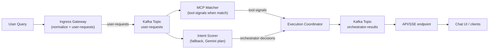

# Kafka-first Orchestrator

## 1. Motivation

The current flow (“Gemini → router → tools”) pays Gemini’s quota just to decide whether to call a tool. For high-signal requests such as _“when’s the next Iration show”_, the answer can be produced by the MCP registry and a fast search tool, so we want to move Gemini from the gatekeeper to a fallback specialist.

## 2. Architectural overview

We lean on the existing Kafka spine to run each part of the orchestration as a separate consumer/producer pair.

- **Ingress Gateway** – normalizes the user text, strips metadata, builds a `context_snapshot` (chat history, session flags), and publishes the request to `user-requests`. Each message includes a UUID so all downstream consumers can correlate progress.
- **MCP Matcher** – a lightweight, deterministic service that loads keywords/embeddings from the registry. When it sees a high-confidence match (regex, embedding distance), it immediately emits a `tool-signals` event describing the tool/server pair and confidence.
- **Intent Scorer** – a Gemini-backed service that consumes `user-requests` in parallel but can slow its consumer group if tooling is overwhelmed. It only acts when no `TOOL_READY` signal arrives within the expected window.
- **Execution Coordinator** – tracks every running request, listens for `tool-signals` and `orchestrator-decisions`, invokes the winning MCP tool (fast-path or Gemini), and publishes a final `orchestrator-results` event that the frontend/SSE endpoints consume.



## 3. Logic flow and bypass strategy

1. The Ingress Gateway normalizes “when’s → when is”, “where’s → where is”, removes lingering design context, and immediately emits `{ request_id, normalized_query, context_snapshot }` to `user-requests`.
2. `user-requests` is consumed by both the MCP Matcher and the Intent Scorer concurrently:
   - The Matcher attempts a keyword/embedding lookup. If confidence exceeds the pre-defined threshold (e.g., _concert search_), it pushes a `TOOL_READY` record to `tool-signals`, including `{ request_id, tool, server_id, confidence }`.
   - The Intent Scorer waits for a short window. If it sees a `TOOL_READY` event for the same `request_id`, it cancels the Gemini call. Otherwise it publishes a Gemini plan to `orchestrator-decisions`.
3. The Execution Coordinator treats the first winner as authoritative. Tool results (from the fast-path or Gemini plan) are persisted and published to `orchestrator-results` so downstream SSE/polling endpoints can stream the final response.

### Race handling

- Use per-request state in the Execution Coordinator to cancel in-flight Gemini plans once `TOOL_READY` arrives.
- Prefer deterministic `tool-signals` over fuzzy LLM plans when confidence is high.
- Keep falling back to the Intent Scorer only when the Matcher cannot resolve the query.

## 4. Kafka schema

| Topic | Payload highlights | Purpose |
| --- | --- | --- |
| `user-requests` | `request_id`, `normalized_query`, `context_snapshot`, `user_id`, `chat_context` | Eingang with cleaned query so both matcher and intent scorer have the same base context. |
| `tool-signals` | `request_id`, `tool`, `server_id`, `confidence`, `status: TOOL_READY` | Matcher claims ownership of the request and provides the concrete tool invocation data. |
| `orchestrator-decisions` | `request_id`, `plan`, `requires_orchestration`, `steps`, `confidence` | Gemini’s plan when the matcher cannot resolve the query. |
| `orchestrator-results` | `request_id`, `tool`, `result`, `tool_path`, `status`, `timestamp` | Coordinator publishes final outputs for API clients/SSE so they can stream results immediately. |

The Kafka services share the same broker settings via the env vars documented in `backend/src/config/env.ts`. The matcher/intent-scorer consumers belong to different consumer groups so they can race without blocking each other.

## 5. Benefits

- **Gemini quota protection**: High-signal search queries are handled by deterministic matcher logic (<50ms) without invoking Gemini.
- **Context isolation**: The normalized request and `context_snapshot` prevent lingering “Design” buffers from influencing fast-path matching.
- **Kafka-based backpressure**: The Intent Scorer can slow down (lower fetch rate) while the matcher continues to claim high-signal requests, avoiding cascading timeouts.
- **Extendable**: Adding a new MCP tool only requires extending the registry + matcher keyword/embedding list; it automatically enters the fast-path lane.

## 6. Implementation Status ✅

**Status: Fully Implemented and Working (December 2024)**

All components have been implemented and are operational:

1. ✅ **Events & Kafka Utilities**: `backend/src/services/orchestrator/events.ts` and `kafka.ts`** - Shared schemas and Kafka utilities implemented
2. ✅ **Ingress Gateway**: `backend/src/services/orchestrator/ingress.ts` - Normalizes queries and publishes to `user-requests`
3. ✅ **MCP Matcher**: `backend/src/services/orchestrator/matcher.ts` - Fast keyword/semantic matching with tool embeddings
4. ✅ **Execution Coordinator**: `backend/src/services/orchestrator/coordinator.ts` - Handles tool signals, invokes tools, publishes results
5. ✅ **Result Consumer**: `backend/src/services/orchestrator/result-consumer.ts` - Shared consumer for query route (eliminates timeouts)
6. ✅ **Query Route**: `backend/src/routes/orchestrator/query.ts` - API endpoint for frontend queries
7. ✅ **Frontend Integration**: `app/chat/page.tsx` - Calls orchestrator endpoint with fallback to old routing
8. ✅ **SSE Parsing**: `backend/src/services/mcp-invoke.service.ts` - Handles Server-Sent Events from Exa and other MCP servers

### Key Features Implemented

- **Shared Result Consumer**: Always-running consumer eliminates rebalance delays and timeouts
- **SSE Response Handling**: Properly parses Server-Sent Events format from Exa MCP server
- **Keyword Pattern Matching**: Fast regex-based matching for high-signal queries (concerts, searches, etc.)
- **Semantic Search**: Fallback to keyword/semantic similarity when regex doesn't match
- **Status Endpoint**: `/api/orchestrator/status` for health checking
- **Comprehensive Logging**: Detailed logs throughout the pipeline for debugging

### Testing

The orchestrator has been tested and verified working:
- ✅ Routes "when is the next iration concert in texas" to Exa MCP server
- ✅ Parses SSE responses correctly
- ✅ Returns results without Gemini quota errors
- ✅ Handles timeouts gracefully with shared consumer

### Configuration

Enable the orchestrator by setting in `backend/.env`:
```env
ENABLE_KAFKA=true
KAFKA_BROKERS=localhost:9092
```

See [Kafka Setup Guide](../docs/KAFKA_SETUP.md) for detailed setup instructions.

