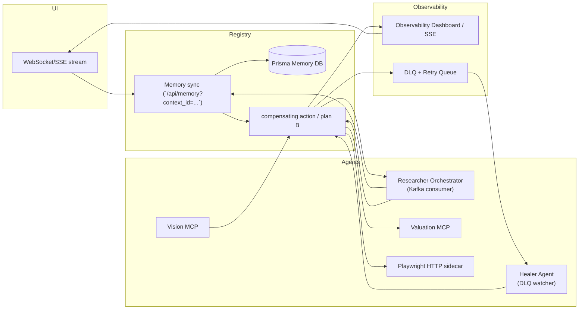

# Reactive Orchestration Flow

## Overview
The platform has moved from tool enablement into agentic orchestration. Kafka powers asynchronous traces, Prisma stores memory, and the registry exposes discovery/memory APIs. This document captures the "Global Context Store" + Reactive Orchestrator approach referenced in the plan, showing how the Vision to Researcher to downstream tools workflow shares intent and how we mark the registry as the state machine for live orchestrations.

## Key components
- [`backend/src/server.ts`](backend/src/server.ts): initializes Kafka, consumers, and registers the registry/memory routes that act as the synchronous gateway for the UI.
- [`backend/src/routes/memory.ts`](backend/src/routes/memory.ts) + [`backend/src/services/memory.service.ts`](backend/src/services/memory.service.ts): define the context store APIs that every agent uses to hydrate prompts and sync outputs.
- [`backend/src/services/event-bus.service.ts`](backend/src/services/event-bus.service.ts) + [`backend/src/services/event-bus-consumer.service.ts`](backend/src/services/event-bus-consumer.service.ts): emit and consume Kafka events that drive the event-driven orchestrator.

## Reactive orchestrator diagram

## Flow description
1. **UI Gateway:** The frontend calls `/v0.1/invoke` to start an agent, which writes intent/memory metadata into the registry and returns a `context_id`. The same request hits `/api/memory` to persist the first snapshot.
2. **Vision MCP:** Executes asynchronously, then emits `vision.analysis.completed` to Kafka. Each event is tagged with `context_id`, `intent`, `last_tool_output`, `memory_snapshot_url`, and `token_budget` so downstream consumers can hydrate their prompts.
3. **Researcher Orchestrator:** A dedicated Kafka consumer listens for vision completion events, syncs memory via `/api/memory` (using the `context_id`), enriches its reasoning, and issues new Kafka events for downstream tools (Valuation, Playwright sidecar). Each emitted event updates the context store to keep the "shared brain" coherent.
4. **Downstream Tool Execution:** HTTP-first MCP servers (e.g., Valuation, Playwright-wrapped) subscribe to their own Kafka events and execute independently while continuing to log results back into memory/registry.
5. **Observability + DLQ:** Kafka writes every event to a trace stream consumed by the UI via WebSocket/SSE so users see "Agent thinking…" updates. Failed messages flow into a DLQ that a "Healer" agent watches, enabling compensating actions (e.g., rerun a tool with alternate parameters).

## Next actionables
- **Handover schema:** Standardize the JSON payload for every Kafka event (`context_id`, `intent`, `last_tool_output`, `memory_snapshot_url`, `token_budget`, `status`). Use this schema across producers (Vision, Researcher, downstream tools) and store the reference in the registry metadata so orchestrators can validate payloads.
- **Registry as state machine:** Treat each workflow as a registry entry with state fields (`lockedBy`, `state`, `attempts`, `context_id`). Agents transition the registry entry (e.g., `VisionAnalyzing` → `VisionCompleted` → `ResearcherQueued`) so any consumer (UI or orchestrator) can observe the live plan and detect stalled states.
- **DLQ / Healer loop:** Introduce a DLQ topic for failed Kafka events. The Healer agent subscribes to the DLQ, inspects the `intent` + `token_budget`, updates the registry state to `PlanB` when needed, and emits recovery events back onto Kafka (or reroutes to alternative tools).
- **UI feedback:** Extend the WebSocket/SSE bridge to stream Kafka events (or a filtered subset) so the frontend renders each "agent thought" step. Each update should reference the current registry state, `context_id`, and the most recent memory snapshot URL.

With this document in place you have both the mermaid visualization and a textual map for how the Reactive Orchestrator implements the "Global Context Store" pattern. Next steps can now focus on wiring up the schema, registry state machine, and DLQ heuristics before adding implementation code.

## Registry state machine & DLQ

### Registry as state machine
- Extend [`backend/src/services/registry.service.ts`](backend/src/services/registry.service.ts) to persist workflow state fields such as `lockedBy`, `state`, `context_id`, `attempts`, and `lastUpdated`.
- Agents should "lock" the registry entry when starting a new phase (e.g., VisionAnalyzing) and transition the state on success or failure (VisionCompleted → ResearcherQueued → ResearcherCompleted). The `/v0.1/servers` response can include these live states so the UI or orchestrator can detect stuck workflows.
- The `context_id` field remains the key to linking registry state with memory snapshots (`/api/memory?context_id=...`) and Kafka events.

### DLQ / Healer flow
- Use [`backend/src/services/event-bus.service.ts`](backend/src/services/event-bus.service.ts) to emit every tool completion event onto both the main topic (`mcp.events.all`) and the DLQ topic (e.g., `mcp.events.dlq`) when retries fail.
- A Healer agent (`backend/src/services/event-bus-consumer.service.ts` or a dedicated consumer) watches the DLQ, inspects the `intent`, `context_id`, and `token_budget`, updates the registry state to `PlanB` when recovery is required, and emits compensating events (e.g., `tool.healer.recover`) back onto Kafka or registers alternate tools via `/v0.1/publish`.
- DLQ events should include enough metadata for the evaluation (error summary, retry count, timestamp) so dashboards and the UI feedback loop can highlight failed orchestration paths.

## Implementation Status

See [`docs/IMPLEMENTATION_GAP_ANALYSIS.md`](IMPLEMENTATION_GAP_ANALYSIS.md) for a detailed comparison of what's documented vs what's implemented, and recommended next steps.
